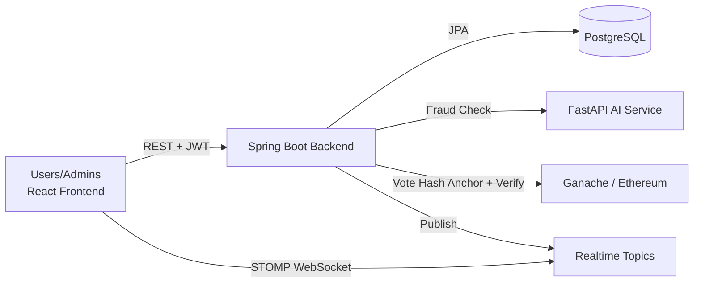

# Secure Digital Voting System with Blockchain and AI Monitoring

Production-ready full-stack project with a Java Spring Boot backend, React frontend, Solidity smart contract on Ethereum (Ganache), and a FastAPI AI microservice.

## Architecture Diagram



## Project Structure

```
Digital-Voting-System/
  backend/        # Spring Boot + Hibernate + JWT + Web3j
  frontend/       # React + Vite + modern custom CSS
  blockchain/     # Solidity smart contract + Hardhat deploy scripts
  ai-service/     # FastAPI fraud/anomaly/audit service
  docker-compose.yml
```

## Key Features

- JWT authentication and role-based access (`ADMIN`, `USER`)
- Strict role-based admin controls for election and candidate management
- BCrypt password hashing
- Age-gated access: only 18+ users can register and login
- Create, update, delete elections (admin only)
- Create, update, delete candidates (admin only)
- Candidate search by name, party, and region
- One vote per user per election (DB unique constraint + service checks)
- Transactional vote casting with race-condition hardening
- Vote hash generation (`SHA-256`) and blockchain anchoring
- Audit verification comparing database vote hash with blockchain verification
- AI fraud detection for suspicious rapid attempts
- AI anomaly summary for voting spikes
- Persistent AI alert storage and admin alert feed
- Real-time vote, alert, and election lifecycle updates via WebSocket (STOMP)
- Refresh-token based JWT session rotation
- In-memory rate limiting for vote APIs to prevent spam bursts
- Cached election and candidate queries for lower read latency
- Admin analytics: participation, candidate trend, and region-wise vote charts
- Audit log system with filters by actor/action/time range
- Pagination and filtering on elections API
- Global exception handling and SLF4J logging
- OpenAPI/Swagger documentation

## Tech Stack

- Backend: Java 21, Spring Boot 3, Spring Security, Hibernate/JPA, Web3j
- Database: PostgreSQL (default, MySQL supported via env)
- Blockchain: Solidity + Hardhat + Ganache
- AI Service: Python FastAPI + NumPy
- Frontend: React + Vite + modern custom CSS

## 1. Prerequisites

- Java 21
- Maven 3.9+
- Node.js 18+
- Python 3.11+
- Docker (optional but recommended for DB + Ganache)

## 2. Start Infrastructure (PostgreSQL + Ganache)

From root:

```bash
docker compose up -d
```

- PostgreSQL: `localhost:5432`
- Ganache RPC: `http://127.0.0.1:7545`

### Full Stack Docker Deployment (Backend + Frontend + AI + DB + Ganache)

Set contract variables if available:

```powershell
$env:ETH_PRIVATE_KEY='<GANACHE_PRIVATE_KEY>'
$env:ETH_CONTRACT_ADDRESS='<DEPLOYED_CONTRACT_ADDRESS>'
docker compose up --build
```

Service URLs:

- Frontend: `http://localhost:5173`
- Backend API: `http://localhost:8080`
- AI service: `http://localhost:8000`

### Optional One-Command Startup (Windows PowerShell)

After deploying the smart contract, set blockchain variables and use the helper script:

```powershell
$env:ETH_PRIVATE_KEY='<GANACHE_PRIVATE_KEY>'
$env:ETH_CONTRACT_ADDRESS='<DEPLOYED_CONTRACT_ADDRESS>'
.\start-all.ps1
```

You can also pass both values explicitly:

```powershell
.\start-all.ps1 -EthPrivateKey '<GANACHE_PRIVATE_KEY>' -EthContractAddress '<DEPLOYED_CONTRACT_ADDRESS>'
```

Stop Docker-backed infrastructure with:

```powershell
.\stop-all.ps1
```

## 3. Deploy Smart Contract

```bash
cd blockchain
cp .env.example .env
npm install
npm run compile
npm run deploy:ganache
```

Copy deployed contract address and one Ganache private key.

## 4. Run AI Service

```bash
cd ai-service
python -m venv .venv
# Windows PowerShell
.\.venv\Scripts\Activate.ps1
pip install -r requirements.txt
uvicorn app.main:app --reload --host 0.0.0.0 --port 8000
```

AI health endpoint: `GET http://localhost:8000/health`

## 5. Run Backend

```bash
cd backend
cp .env.example .env
```

Set environment variables in shell or IDE run configuration:

- `DB_URL`
- `DB_USER`
- `DB_PASSWORD`
- `DB_DRIVER`
- `JWT_SECRET` (base64)
- `ETH_RPC_URL`
- `ETH_PRIVATE_KEY`
- `ETH_CONTRACT_ADDRESS`
- `AI_SERVICE_URL`

Run:

```bash
mvn spring-boot:run
```

### Backend Local Fallback (No Docker/PostgreSQL)

For quick local smoke tests, you can run backend with in-memory H2:

```powershell
$env:DB_URL='jdbc:h2:mem:secure_voting;MODE=PostgreSQL;DB_CLOSE_DELAY=-1'
$env:DB_USER='sa'
$env:DB_PASSWORD=''
$env:DB_DRIVER='org.h2.Driver'
mvn spring-boot:run
```

Swagger UI:

- `http://localhost:8080/swagger-ui.html`

Seed users:

- Admin: `admin / Admin@123`
- User: `voter1 / Voter@123`

## 6. Run Frontend

```bash
cd frontend
cp .env.example .env
npm install
npm run dev
```

App URL:

- `http://localhost:5173`

## API Overview

### Auth
- `POST /api/auth/register`
- `POST /api/auth/login`
- `POST /api/auth/refresh`
- `POST /api/auth/logout`

### Elections
- `GET /api/elections?page=0&size=10` (public active elections only)

### Voting
- `POST /api/votes`
- `GET /api/votes/status?electionId={id}`

### Candidates
- `GET /api/candidates/search?name=&party=&region=&page=0&size=20`

### Admin
- `GET /api/admin/elections?status=&page=0&size=20`
- `POST /api/admin/elections`
- `PUT /api/admin/elections/{electionId}`
- `DELETE /api/admin/elections/{electionId}`
- `POST /api/admin/elections/{electionId}/candidates`
- `PUT /api/admin/candidates/{candidateId}`
- `DELETE /api/admin/candidates/{candidateId}`
- `GET /api/admin/elections/{electionId}/results`
- `GET /api/admin/elections/{electionId}/audit`
- `GET /api/admin/elections/{electionId}/analytics`
- `GET /api/admin/audit-logs?actor=&action=&fromTime=&toTime=&page=0&size=20`

### Monitoring
- `GET /api/monitoring/anomaly-summary`
- `GET /api/monitoring/alerts?page=0&size=20`

## WebSocket Topics

- Endpoint: `/ws` (SockJS + STOMP)
- Admin live vote counts: `/topic/admin/votes`
- Admin AI alerts: `/topic/admin/alerts`
- User notifications: `/topic/users/{username}/notifications`
- Election lifecycle notifications: `/topic/elections/lifecycle`

## Frontend Highlights

- Modern React dashboard UX with glassmorphism-inspired cards and responsive layout
- Role-aware routing (`/admin` for admin users, `/dashboard` for voters)
- User dashboard with active elections, vote status badges, and voting actions
- Admin sidebar dashboard for election/candidate CRUD, results, and AI alerts
- Candidate profile page with search filters
- Loading spinners and dismissible notifications across major views

## Security Notes

- Stateless JWT security with role authorization
- JWT refresh token rotation and explicit logout token revocation
- Passwords are hashed using BCrypt
- Vote uniqueness is enforced in service layer and DB unique constraint
- Vote endpoint rate limiting to mitigate spam
- Optimistic locking enabled using `@Version` in entities

## Hibernate/JPA Notes

- Proper entity relationships (`OneToMany`, `ManyToOne`)
- Lazy fetching on relation-heavy fields
- JPQL vote count query for election results
- Batch write settings configured in `application.yml`

## Production Hardening Recommendations

- Move from simple cache to Redis/Ehcache second-level cache
- Use HTTPS termination and secure cookies in production gateway
- Store blockchain keys in vault/KMS, not plain env in shared environments
- Add unit/integration tests and load tests
- Add observability (OpenTelemetry + centralized logs)

## CI/CD

GitHub Actions workflow added at `.github/workflows/ci.yml`:

- Backend Maven compile
- Frontend build
- AI service dependency/import check
